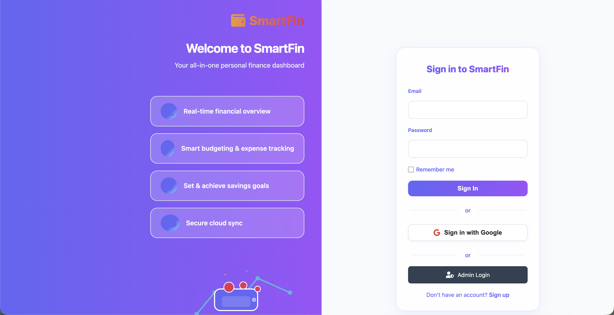
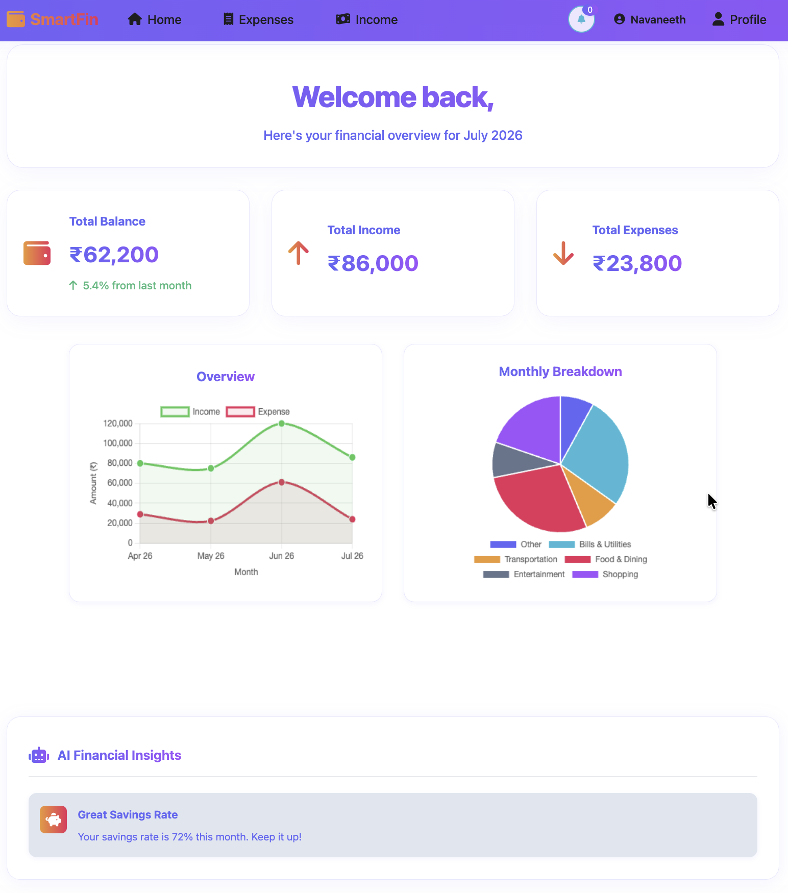
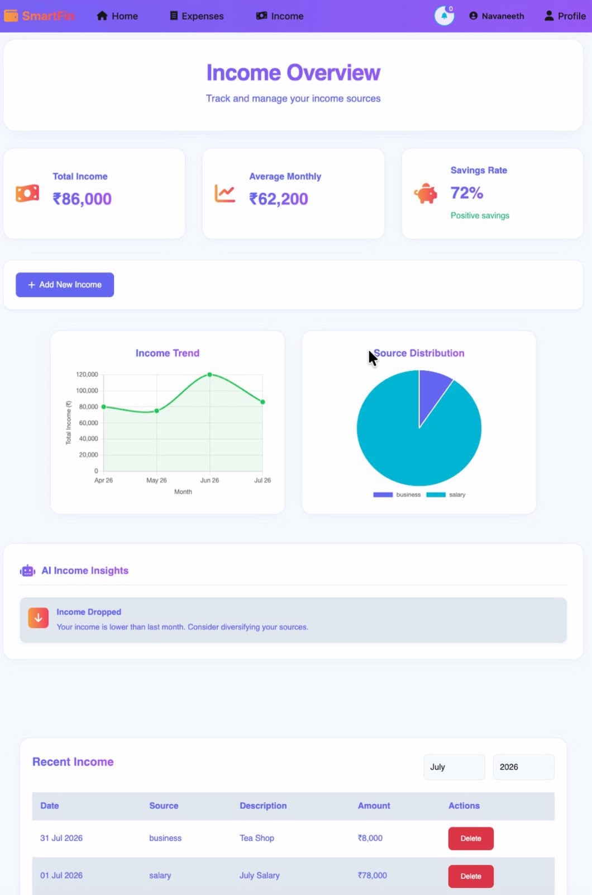
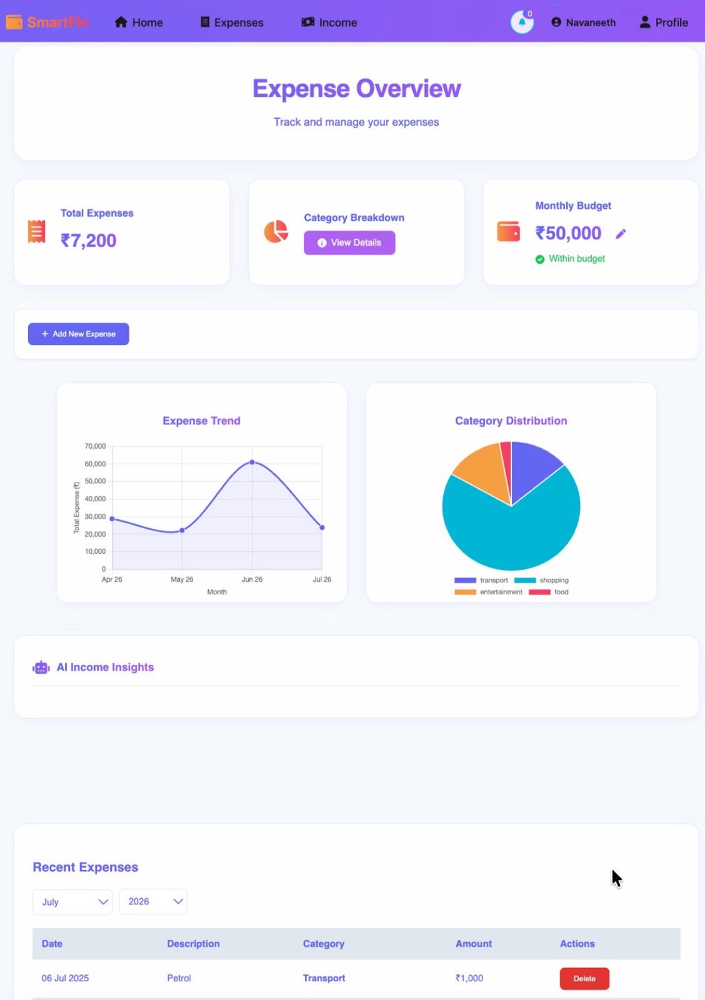

# SmartFin

SmartFin is a personal finance web app for tracking income, expenses, and budget usage, with Firebase-based authentication, a Flask backend, and MongoDB persistence. The project includes separate user and admin experiences, finance dashboards, and shared UI components for theme and navigation handling.

## Overview

The app is organized as a static front end with supporting backend APIs. Users can sign up, log in, manage finances, and view dashboard summaries. Admin users have a separate panel for user management and system status pages.

## Features

- User authentication with email/password and Google sign-in.
- Separate user and admin login flows.
- Income, expense, and budget tracking.
- Dashboard views with charts and summary cards.
- Shared theme system and reusable navigation components.
- Admin user management endpoints for listing, creating, deleting, disabling, and updating users.

## Tech Stack

- Front end: HTML, CSS, JavaScript
- Auth: Firebase Authentication
- Backend: Flask
- Database: MongoDB
- Visualization: Chart.js
- Icons and UI assets: Font Awesome, custom CSS

## Project Structure

```text
SmartFin/
├── admin/
│   ├── ai-status/
│   ├── components/
│   ├── dashboard/
│   └── login/
├── assets/
├── backend/
├── components/
├── expense/
├── firebase-config/
├── home/
├── income/
├── login/
├── profile/
├── shared/
└── signup/
```

### Main areas

- `home/`: User dashboard and overview charts.
- `login/` and `signup/`: User authentication screens.
- `income/` and `expense/`: Transaction entry and management pages.
- `profile/`: User profile area.
- `admin/`: Admin login, dashboard, and AI status pages.
- `shared/`: Theme configuration and shared utilities.
- `firebase-config/`: Firebase client initialization.
- `backend/`: Flask API for finance data and admin operations.

## Screenshots

### Login and Signup



### Home Dashboard



### Income Tracking



### Expense Tracking



### Admin Login


### Admin Dashboard


## Prerequisites

- Python 3.10 or newer
- MongoDB database access
- Firebase project with Authentication enabled
- A local HTTP server for the front end, such as VS Code Live Server or Python's `http.server`

## Setup

1. Clone or open the repository in VS Code.
2. Add your Firebase service account JSON at the project root as `serviceAccountKey.json`.
3. Verify the Firebase client config in `firebase-config/firebase-config.js` matches your Firebase project.
4. Update the MongoDB connection string in `backend/app.py` if you are not using the current database.
5. Install the Python backend dependencies:

```bash
python3 -m pip install flask flask-cors pymongo firebase-admin
```

## Run the app locally

### 1. Start the backend

From the project root:

```bash
python3 backend/app.py
```

The Flask server runs with debug mode enabled and exposes API endpoints under `http://127.0.0.1:5000`.

### 2. Serve the front end

Because the front end uses absolute paths like `/components/navbar.html` and module imports, it should be opened through a local web server instead of directly from the file system.

If you want to stay close to the backend CORS allowlist, use port 5500:

```bash
python3 -m http.server 5500
```

Then open the relevant page in your browser, for example:

- `http://localhost:5500/login/login.html`
- `http://localhost:5500/signup/signup.html`
- `http://localhost:5500/home/home.html`

## Backend API

The Flask app currently provides these routes:

- `POST /api/expenses`
- `GET /api/expenses/<uid>`
- `DELETE /api/expenses/<expense_id>`
- `POST /api/incomes`
- `GET /api/incomes/<uid>`
- `DELETE /api/incomes/<income_id>`
- `GET /api/budget/<uid>`
- `POST /api/budget`
- `GET /admin/list-users`
- `DELETE /admin/delete-user/<uid>`
- `POST /admin/create-user`
- `POST /admin/change-password/<uid>`
- `POST /admin/toggle-disable/<uid>`

## Notes

- The app is designed for local development and manual testing through static pages plus the Flask backend.
- The backend currently expects `serviceAccountKey.json` to exist at the repository root.
- For production use, move secrets and connection strings into environment variables before deployment.
